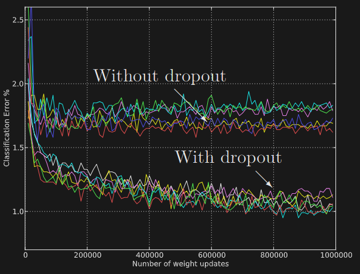
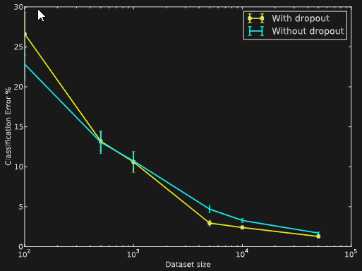

# Dropout in Neural Networks

## 1. Introduction

* At test time, it is impractical to average predictions from all possible thinned models due to the exponential of combinations.  
&rarr;  Instead, a simple approximate averaging method is used. A single neural network without dropout is employed be scaling down the trained weights.

**Note:** Complex `co-adaptations` can be trained to work well on a training set, but on novel test data they are far more likely to fail than multiple simpler co-adaptations that achieve the same thing.

## 2. Experimental Results
### 2.1 MNIST
Dropout neural networks pretrained with stacks of RBMs and Deep Boltzmann Machines give the best result with test error of 0.79%.  

### 2.2 Street View House Numbers
For this data set, they applied dropout to convolutional neural networks.  
&rarr; The best architecture that was found has three convolutional layers followed by 2 fully connected hidden layers. All hidden units were ReLUs. Each convolutional layer was followed by a max-pooling layer.

### 2.3 Results on a Text Data Set
The improvement was much smaller compared to that for the vision and speech data sets.

### 2.4 Comparision with Bayesian Neural Networks
* In dropout, each model is weighted equally
* In a Bayesian neural network each model is weighted taking in to account the prior and how well the model fits the data  
&rarr; Which is the more correct approach 

**Notes:** However, with dropout we were ale to prevent overfitting without the need to do dimensionality reduction.  
&rarr; This shows that dropout has a string regularizing effect.

### 2.5 Comparision with Standard Regularizers
| Method                               | Test Classification error % |
|--------------------------------------|-----------------------------|
| L2                                   | 1.62                        |
| L2 + L1 applied towards the end of training | 1.60                 |
| L2 + KL-sparsity                     | 1.55                        |
| Max-norm                             | 1.35                        |
| Dropout + L2                         | 1.25                        |
| Dropout + Max-norm                   | 1.05                        |

&rarr; Dropout combined with max-norm regularization gives the lowest generalization error.

## 3. Salient Features
### 3.1 Effect of Data Set Size
Huge neural networks trained in standard way overfit massively on small data sets.

* With small datasets, dropout does not give any improvements.
* As the size of the data set is increased, the gain from doing dropout increases up to a point and then declines.

## 4. Marginalizing Dropout
`Dropout can be seen as a way of adding noise to the states of hidden units in a neural network.`

* Dropout with linear regression is equivalent, in expectation, to ridge regression with a paritcular form.
